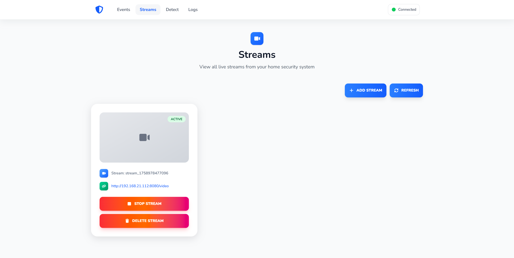
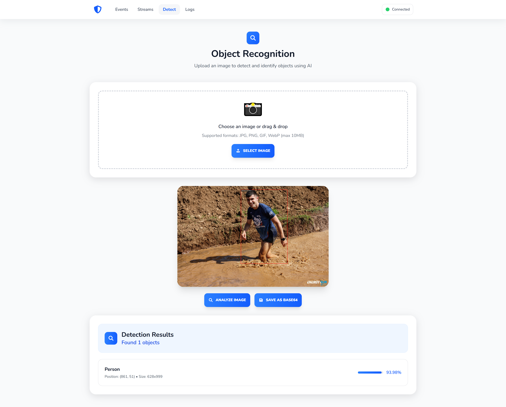
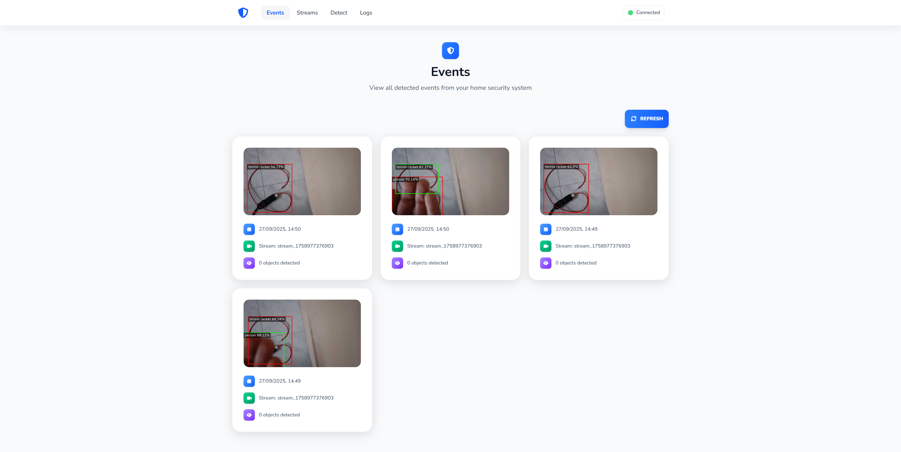
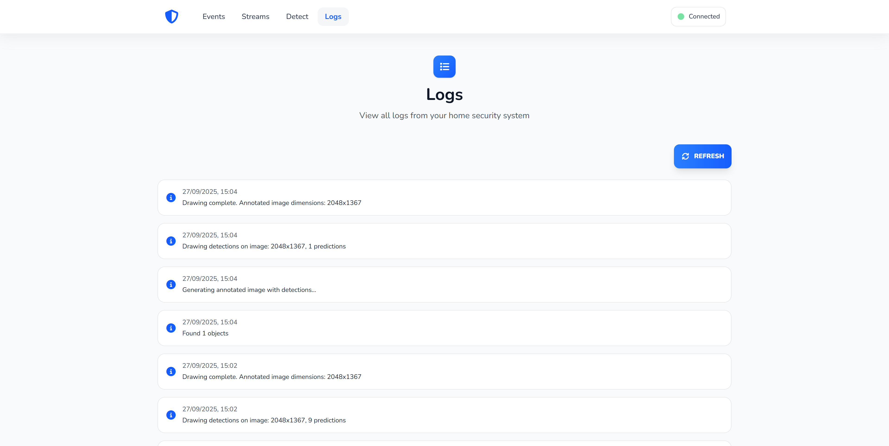

# 🏠🔒 Home Security System

Welcome to the **Home Security System**! 🚀 This is a comprehensive, open-source home security solution that combines cutting-edge AI-powered object detection with a sleek web interface. Whether you're monitoring your home remotely or keeping an eye on your property, this system has got you covered! 😊

## 🌟 Features

- **Real-time Video Streaming** 📹: Monitor live feeds from multiple cameras with ease.
- **AI-Powered Object Detection** 🤖: Uses YOLOv11 for accurate detection of people, objects, and more.
- **Event Logging** 📝: Automatically logs security events with timestamps and images.
- **User-Friendly Dashboard** 💻: A beautiful Nuxt 3 frontend for managing streams, viewing events, and checking logs.
- **WebSocket Integration** 🔄: Real-time updates without page refreshes.
- **Modular Architecture** 🏗️: Separate frontend (Nuxt 3), backend (Node.js), and inference server (Python) for scalability.
- **Cross-Platform** 🌐: Works on Windows, macOS, and Linux.

## 📸 Screenshots

### Streams Management


### Object Recognition


### Events Overview


### Logs View


## 🛠️ Installation

Getting started is super easy! Follow these steps to set up your own home security system. 💪

### Prerequisites
- Node.js (v16 or higher) 📦
- Python 3.8+ 🐍
- Git 🌳
- A webcam or IP camera 📷

### 1. Clone the Repository
```bash
git clone https://github.com/brumaombra/home-security.git
cd home-security
```

### 2. Set Up the Python Inference Server
This handles the AI object detection using YOLO.

```bash
cd python-inference-server
pip install -r requirements.txt
```

### 3. Set Up the Node.js Backend
The backend manages video analysis and API endpoints.

```bash
cd ../video-analysis
npm install
```

### 4. Set Up the Nuxt 3 Frontend
The dashboard for monitoring and management.

```bash
cd ../user-dashboard
npm install
```

## 🚀 Usage

### Start the Inference Server
```bash
cd python-inference-server
python app.py
```

### Start the Backend
```bash
cd video-analysis
npm start
```

### Start the Frontend
```bash
cd user-dashboard
npm run dev
```

Open your browser and go to `http://localhost:3000` to access the dashboard! 🎉

### Adding a Stream
1. Go to the Streams page in the dashboard.
2. Click "Add Stream" ➕
3. Enter your camera's RTSP URL or use a local webcam.
4. Start monitoring! 👀

## 🏗️ Architecture

- **Frontend (Nuxt 3)**: Vue.js-based dashboard with real-time updates via WebSockets.
- **Backend (Node.js)**: Handles API requests, video processing, and data storage.
- **Inference Server (Python)**: Runs YOLO object detection on video frames.

## 🤝 Contributing

We love contributions! 🌟 If you'd like to improve the Home Security System:

1. Fork the repository 🍴
2. Create a feature branch: `git checkout -b feature/amazing-feature`
3. Commit your changes: `git commit -m 'Add amazing feature'`
4. Push to the branch: `git push origin feature/amazing-feature`
5. Open a Pull Request 🚀

Please read our [Contributing Guidelines](CONTRIBUTING.md) for more details.

## 📄 License

This project is licensed under the MIT License - see the [LICENSE](LICENSE) file for details. 📜

## 🙏 Acknowledgments

- Thanks to the YOLO team for the amazing object detection model! 🙌
- Built with love using Nuxt 3, Node.js, and Python. ❤️

## 📞 Support

If you have any questions or need help, feel free to open an issue on GitHub or reach out to the maintainers. We're here to help! 😄

---

**Stay safe and secure!** 🛡️✨